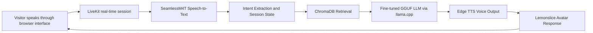

# Hala Voice Assistant
### AI-Powered Multilingual Persona for Customer Support in ICP Service Centers

Hala is a real-time multilingual voice assistant created to help visitors at an ICP service center. It provides conversational guidance for Emirates ID-related services, including new issuance, renewal, lost or damaged ID replacement, required documents, fees, steps, and fingerprint-related questions.

The project combines a local fine-tuned language model, Retrieval-Augmented Generation (RAG), speech interaction, LiveKit real-time communication, and an avatar interface to create an accessible digital support experience.

---

## Project Goal

Visitors at service centers may face language barriers, repeated questions, uncertainty about required documents, and delays while waiting for support. Hala aims to provide immediate, consistent, and multilingual guidance through a voice-based assistant.

The assistant is designed to:

- Answer ICP-related questions from a prepared knowledge base.
- Ask clarification questions when required details are missing.
- Retrieve relevant verified information before forming a response.
- Provide real-time spoken interaction through an avatar interface.
- Run locally using Docker and a quantized GGUF language model.

---

## Main Features

- Real-time voice interaction through **LiveKit**.
- Multilingual speech recognition using **SeamlessM4T**.
- Local fine-tuned LLM inference using **llama.cpp** and a GGUF model.
- Smart retrieval using **ChromaDB** and **Nomic embeddings**.
- Session state and intent extraction for adaptive conversations.
- Voice output using **Edge TTS**.
- Avatar integration through **Lemonslice**.
- Docker-based deployment on a Windows laptop.

---

## System Architecture



---

## Technologies Used

| Component | Technology |
|---|---|
| Frontend interface | HTML, CSS, JavaScript, Flask |
| Real-time communication | LiveKit |
| Avatar integration | Lemonslice |
| Speech-to-text | `facebook/hf-seamless-m4t-medium` |
| Text-to-speech | Edge TTS |
| Language model | Fine-tuned GGUF model served with `llama.cpp` |
| Embeddings | `nomic-ai/nomic-embed-text-v1.5` |
| Vector database | ChromaDB |
| Deployment | Docker Desktop and Docker Compose |

---

## Project Structure

```text
Hala-Voice-Assistant/
├── agent/
│   ├── Data/
│   │   └── ICP_doc_RAG_optimized.txt
│   ├── chroma_icp_db/          # Generated locally
│   ├── emb_chunk.py            # Creates the Chroma knowledge database
│   ├── hala.py                 # RAG retrieval logic
│   ├── seamless_stt.py         # SeamlessM4T speech recognition
│   ├── v6.py                   # Main LiveKit voice agent
│   ├── Dockerfile
│   └── requirements.txt
├── frontend/
│   ├── public/                 # Browser interface files
│   ├── token_server.py         # Frontend server and token endpoint
│   └── Dockerfile
├── models/                     # Local only; not uploaded to GitHub
│   └── icp_assistant_model_llama_5_q4.gguf
├── .env                        # Local secrets; not uploaded to GitHub
├── .gitignore
├── docker-compose.yml
└── README.md
```

---

# Deployment on Another Windows Laptop Using Docker

## 1. Requirements

### Recommended Hardware

Because Hala runs a local LLM and a speech model together, the deployment laptop should preferably have:

- Windows 10 or Windows 11, 64-bit.
- At least **16 GB RAM**.
- At least **30 GB free disk space**.
- Working microphone and speakers.
- Stable internet connection during initial installation and model download.

> Lower-memory laptops may be slow or may terminate the speech worker. The settings below reduce memory use for a single-user kiosk deployment.

### Required Software

Install:

1. Git
2. WSL 2
3. Docker Desktop with the WSL 2 Linux engine enabled

Docker Desktop includes Docker Compose.

---

## 2. Install Git, WSL 2, and Docker Desktop

Open **PowerShell as Administrator**.

### Install Git

```powershell
winget install --id Git.Git -e --source winget
git --version
```

### Install or update WSL 2

```powershell
wsl --install
wsl --update
```

Restart the laptop if requested.

### Install Docker Desktop

```powershell
winget install --id Docker.DockerDesktop -e --source winget
```

Open Docker Desktop and wait until its engine is running. Verify:

```powershell
docker --version
docker compose version
docker ps
```

---

## 3. Clone the Repository

```powershell
cd C:\Users\ICP
git clone https://github.com/Huda-786/Hala-Voice-Assistant.git
cd Hala-Voice-Assistant
dir
```

---

## 4. Create the Environment File

Create `.env` in the project root:

```powershell
notepad .env
```

Add your real credentials:

```env
LIVEKIT_URL=wss://YOUR_LIVEKIT_PROJECT_URL
LIVEKIT_API_KEY=YOUR_LIVEKIT_API_KEY
LIVEKIT_API_SECRET=YOUR_LIVEKIT_API_SECRET
LEMONSLICE_API_KEY=YOUR_LEMONSLICE_API_KEY
```

> Never upload `.env` to GitHub or share screenshots containing these keys.

---

## 5. Add the Fine-Tuned GGUF Model

The model is not stored in GitHub because it is large. Copy it manually to the deployment laptop:

```powershell
mkdir models
Copy-Item "E:\icp_assistant_model_llama_5_q4.gguf" ".\models\icp_assistant_model_llama_5_q4.gguf"
dir .\models
```

The required model file is:

```text
models\icp_assistant_model_llama_5_q4.gguf
```

---

## 6. Confirm Deployment Configuration

For a client laptop, `docker-compose.yml` should load the correct model with reduced-memory settings:

```yaml
llama-server:
  image: ghcr.io/ggml-org/llama.cpp:server
  container_name: hala-llama
  ports:
    - "8000:8000"
  volumes:
    - ./models:/models
  command: >
    -m /models/icp_assistant_model_llama_5_q4.gguf
    --host 0.0.0.0
    --port 8000
    --ctx-size 2048
    --parallel 1
  restart: unless-stopped
```

For stable deployment, the `agent` service should run with:

```yaml
command: python v6.py start
```

In `agent/v6.py`, both LLM sections should use the model ID returned by the running Llama server. For this model:

```python
model="icp_assistant_model_llama_5_q4.gguf"
```

To reduce memory usage, `WorkerOptions` should use one idle speech process:

```python
WorkerOptions(
    entrypoint_fnc=entrypoint,
    prewarm_fnc=prewarm,
    initialize_process_timeout=180,
    num_idle_processes=1,
    multiprocessing_context="spawn",
    job_memory_warn_mb=1600,
)
```

In `agent/seamless_stt.py`, speech input should be passed as:

```python
inputs = self.processor(
    audios=audio,
    sampling_rate=16000,
    src_lang=src_lang,
    return_tensors="pt",
)
```

---

## 7. Build the Docker Images

```powershell
docker compose build
```

---

## 8. Download Speech and Embedding Models

Run once during installation:

```powershell
docker compose run --rm download-models
```

This downloads and caches:

- `facebook/hf-seamless-m4t-medium`
- `nomic-ai/nomic-embed-text-v1.5`

---

## 9. Build the Chroma Knowledge Database

Run once after installation, or whenever the ICP knowledge document changes:

```powershell
docker compose run --rm build-chroma
```

A successful run ends with:

```text
Ingested 40 chunks into ChromaDB
Saved at: chroma_icp_db
```

---

## 10. Start and Test the Local LLM Server

Start the model service first:

```powershell
docker compose up -d llama-server
docker compose logs -f llama-server
```

After the model finishes loading, press `Ctrl + C` and verify the API:

```powershell
Invoke-RestMethod -Uri "http://localhost:8000/v1/models"
```

It should return:

```text
icp_assistant_model_llama_5_q4.gguf
```

### Optional Direct LLM Test

```powershell
$body = @{
    model = "icp_assistant_model_llama_5_q4.gguf"
    messages = @(
        @{
            role = "user"
            content = "Hello. What services can you help me with?"
        }
    )
    temperature = 0.2
    max_tokens = 100
} | ConvertTo-Json -Depth 5

$response = Invoke-RestMethod `
    -Uri "http://localhost:8000/v1/chat/completions" `
    -Method Post `
    -ContentType "application/json" `
    -Body $body

$response.choices[0].message.content
```

---

## 11. Start the Frontend and Agent

```powershell
docker compose up -d frontend agent
docker compose ps
docker compose logs -f agent
```

Healthy logs should include:

```text
RAG assistant is ready with stateful metadata filtering.
Prewarming SeamlessM4T...
SeamlessM4T ready on cpu.
process initialized
registered worker
```

---

## 12. Test the Interface

Test the token endpoint:

```powershell
Invoke-RestMethod -Uri "http://localhost:3000/token?lang=en&region=middle_east&mode=reception"
```

Open Hala:

```powershell
Start-Process "http://localhost:3000"
```

Allow microphone access and ask:

```text
What documents do I need for a lost Emirates ID?
```

A successful end-to-end test confirms the frontend, LiveKit, STT, RAG retrieval, local LLM, TTS, and avatar output work together.

---

# Starting and Stopping Later

Start Hala:

```powershell
cd C:\Users\ICP\Hala-Voice-Assistant
docker compose up -d
Start-Process "http://localhost:3000"
```

Stop Hala:

```powershell
docker compose down
```

---

# Updating the Client Laptop from GitHub

```powershell
cd C:\Users\ICP\Hala-Voice-Assistant
docker compose down
git pull origin main
docker compose build agent frontend
docker compose up -d
```

Rebuild ChromaDB only when the ICP knowledge document or ingestion code changes:

```powershell
docker compose run --rm build-chroma
```

---

# Troubleshooting

## Docker returns `500 Internal Server Error`

If Docker commands mention `dockerDesktopLinuxEngine`, restart Docker Desktop. If necessary:

```powershell
wsl --shutdown
```

Reopen Docker Desktop and verify:

```powershell
docker ps
```

## Model file not found

```powershell
dir .\models
```

Confirm this exact file exists:

```text
icp_assistant_model_llama_5_q4.gguf
```

## Chroma build fails with `Device or resource busy`

Because the Chroma directory is mounted into Docker, the script must clear its contents rather than delete the mounted directory itself:

```python
chroma_path = Path(CHROMA_DIR)

if chroma_path.exists():
    for item in chroma_path.iterdir():
        if item.is_dir():
            shutil.rmtree(item)
        else:
            item.unlink()
else:
    chroma_path.mkdir(parents=True, exist_ok=True)
```

After changing Python code:

```powershell
docker compose build build-chroma
docker compose run --rm build-chroma
```

## Agent uses high memory or crashes

Use:

```yaml
--ctx-size 2048
--parallel 1
```

and:

```python
num_idle_processes=1
```

A laptop with at least 16 GB RAM is recommended.

## `.env` was changed but the error remains

Recreate the services that use `.env`:

```powershell
docker compose up -d --force-recreate --no-deps frontend agent
```

---

# Security Notes

Do not commit these files or folders:

```gitignore
.env
models/
*.gguf
hf-cache/
agent/chroma_icp_db/
```

---

## Team Members

- Amnah Khaled — 202210779
- Hala Renan — 202211790
- Lubna Sher Aslam — 202120102
- Alanood Tawfeeq — 202211607
- Huda Mohammed Bilal — 202211270

### Supervised By

- Dr. Mahmoud Shboul
- Dr. Mahmoud Hammad

---

## Reference Documentation

- [Docker Desktop for Windows](https://docs.docker.com/desktop/setup/install/windows-install/)
- [Docker Compose Installation](https://docs.docker.com/compose/install/)
- [Docker Desktop WSL 2 Backend](https://docs.docker.com/desktop/features/wsl/)
- [llama.cpp HTTP Server](https://github.com/ggml-org/llama.cpp/blob/master/tools/server/README.md)
- [LiveKit Agents Documentation](https://docs.livekit.io/agents/)
- [LiveKit Agent Server Options](https://docs.livekit.io/agents/server/options/)
